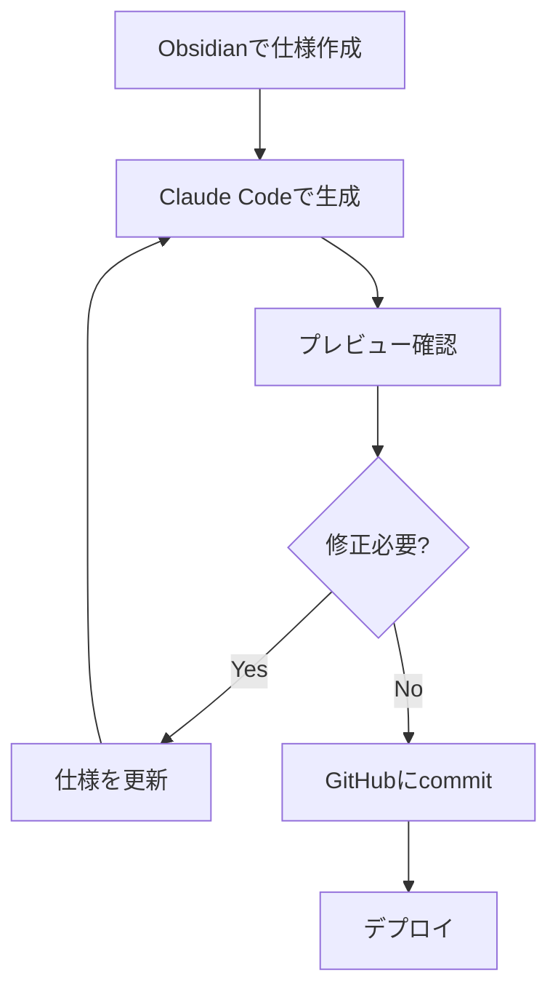

# デモ: Next.jsでLP作成

## Obsidian × Claude Code の実践例

---

## シナリオ

Obsidianで仕様を書いて、Claude CodeでNext.jsのLPを一気に生成する

---

## Step 1: Obsidianに仕様を書く

```markdown
## LP仕様書

### ページ構成
1. ヒーローセクション（キャッチコピー + CTA）
2. 特徴紹介（3カラム）
3. 料金プラン（3プラン）
4. FAQ（アコーディオン）
5. CTA + フッター

### デザイン要件
- モダンでクリーンなデザイン
- レスポンシブ対応
- Tailwind CSS使用
```

---

## Step 2: Claude Codeに依頼

```
この仕様書を元に、Next.js + Tailwind CSSで
LPを作成してください。
App Routerを使用してください。
```

---

## Step 3: 生成されるもの

```
app/
├── page.tsx           ← メインLP
├── layout.tsx         ← レイアウト
└── components/
    ├── Hero.tsx       ← ヒーローセクション
    ├── Features.tsx   ← 特徴紹介
    ├── Pricing.tsx    ← 料金プラン
    ├── FAQ.tsx        ← FAQ
    └── Footer.tsx     ← フッター
```

---

## ポイント

- **仕様が明確**なほど、生成精度が上がる
- **コンポーネント分割**も自動で提案される
- **修正依頼**も自然言語でOK
  - 「ヒーローの背景をグラデーションにして」
  - 「料金プランを4つに増やして」

---

## 実際のワークフロー



---

## 関連スライド

- 前へ: [[06_practice3|実践③ 生きてるドキュメント]]
- 次へ: [[08_rules|運用ルール]]
