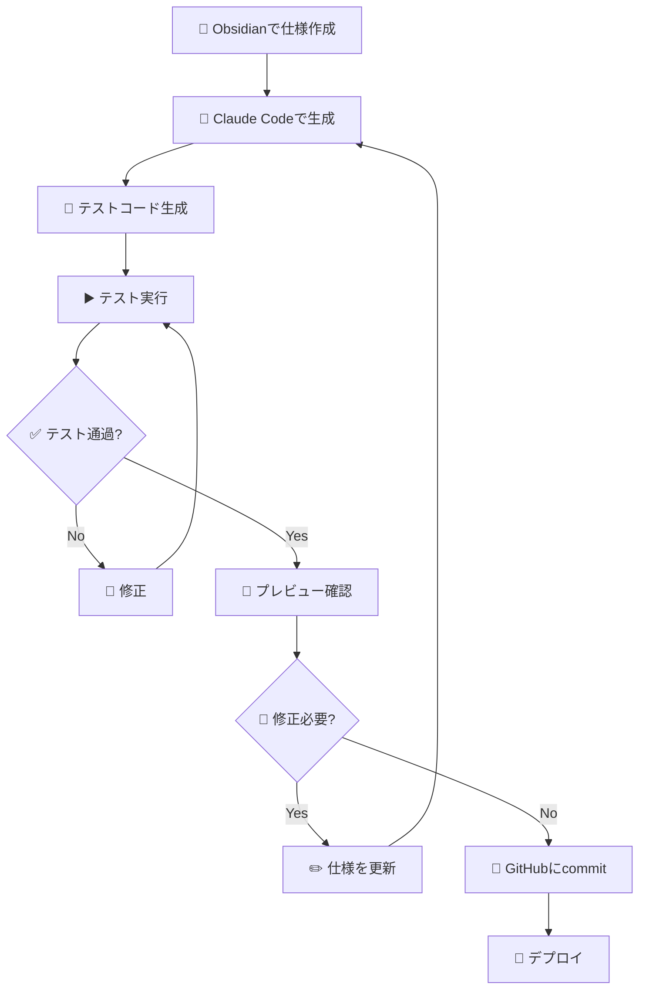

# 🎨 デモ: Next.jsでLP作成

## 💎 Obsidian × 🤖 Claude Code の実践例

---

## 📋 シナリオ

Obsidianで仕様を書いて、Claude CodeでNext.jsのLPを一気に生成する

---

## 📝 Step 1: Obsidianに仕様を書く

```markdown
## LP仕様書

### 📄 ページ構成
1. ヒーローセクション（キャッチコピー + CTA）
2. 特徴紹介（3カラム）
3. 料金プラン（3プラン）
4. FAQ（アコーディオン）
5. CTA + フッター

### 🎨 デザイン要件
- モダンでクリーンなデザイン
- レスポンシブ対応
- Tailwind CSS使用
```

---

## 🤖 Step 2: Claude Codeに依頼

```
この仕様書を元に、Next.js + Tailwind CSSで
LPを作成してください。
App Routerを使用してください。
```

---

## 📂 Step 3: 生成されるもの

```
app/
├── page.tsx           ← 🏠 メインLP
├── layout.tsx         ← 📐 レイアウト
└── components/
    ├── Hero.tsx       ← 🦸 ヒーローセクション
    ├── Features.tsx   ← ✨ 特徴紹介
    ├── Pricing.tsx    ← 💰 料金プラン
    ├── FAQ.tsx        ← ❓ FAQ
    └── Footer.tsx     ← 🔻 フッター
```

---

## 🧪 Step 4: テストコードも自動生成

### 💬 Claude への依頼

```
Pricingコンポーネントのテストを書いてください。
Vitestを使用してください。
```

---

## 📝 生成されるテストコード

```typescript
// __tests__/Pricing.test.tsx
import { render, screen } from '@testing-library/react'
import { describe, it, expect } from 'vitest'
import Pricing from '@/components/Pricing'

describe('Pricing', () => {
  it('3つのプランが表示される', () => {
    render(<Pricing />)

    expect(screen.getByText('スタータープラン')).toBeInTheDocument()
    expect(screen.getByText('プロプラン')).toBeInTheDocument()
    expect(screen.getByText('エンタープライズ')).toBeInTheDocument()
  })

  it('各プランに価格が表示される', () => {
    render(<Pricing />)

    expect(screen.getByText('¥980/月')).toBeInTheDocument()
    expect(screen.getByText('¥2,980/月')).toBeInTheDocument()
    expect(screen.getByText('お問い合わせ')).toBeInTheDocument()
  })

  it('CTAボタンがクリックできる', () => {
    render(<Pricing />)

    const buttons = screen.getAllByRole('button')
    expect(buttons).toHaveLength(3)
  })
})
```

---

## ✅ デモ①: テストが通る様子

```bash
$ npm run test

 ✓ __tests__/Pricing.test.tsx (3)
   ✓ Pricing
     ✓ 3つのプランが表示される
     ✓ 各プランに価格が表示される
     ✓ CTAボタンがクリックできる

 Test Files  1 passed (1)
      Tests  3 passed (3)
```

> 🎉 仕様通りに実装されていることが**自動で検証**される

---

## ❌ デモ②: バグを入れるとテストが落ちる

### わざとプラン名を変更してみる

```typescript
// components/Pricing.tsx
- <h3>スタータープラン</h3>
+ <h3>ビギナープラン</h3>  // ← 😱 間違えた！
```

---

## 💥 テスト結果: 失敗！

```bash
$ npm run test

 ❌ __tests__/Pricing.test.tsx (3)
   ❌ Pricing
     ❌ 3つのプランが表示される
       TestingLibraryElementError:
       Unable to find an element with the text: スタータープラン
     ✓ 各プランに価格が表示される
     ✓ CTAボタンがクリックできる

 Test Files  1 failed (1)
      Tests  1 failed | 2 passed (3)
```

> 🚨 仕様と実装のズレを**即座に検知**！

---

## 🏆 テスト駆動のメリット

1. 🔍 **仕様変更に気づける** - 意図しない変更を検知
2. 🛡️ **リファクタリングが安心** - 壊れたらすぐ分かる
3. 📚 **ドキュメント代わり** - テストが仕様書になる

---

## 💡 ポイント

- 📝 **仕様が明確**なほど、生成精度が上がる
- 🧩 **コンポーネント分割**も自動で提案される
- 🧪 **テストコード**も仕様から自動生成
- 💬 **修正依頼**も自然言語でOK
  - 「ヒーローの背景をグラデーションにして」
  - 「料金プランを4つに増やして」

---

## 🔄 実際のワークフロー



---

## 🔗 関連スライド

- 前へ: [[08_practice3|実践③ 生きてるドキュメント]]
- 次へ: [[10_demo_scraping|デモ: Webスクレイピング]]
