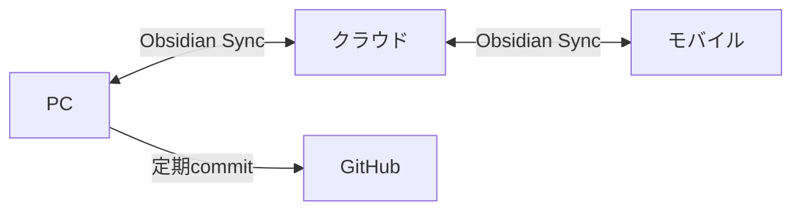

# Obsidian Sync

## チーム共有をさらに強化する

---

## Obsidian Sync とは？

Obsidian公式のクラウド同期サービス

- **エンドツーエンド暗号化**で安全
- **リアルタイム同期**で複数デバイス対応
- **バージョン履歴**で過去の状態に戻せる

---

## Claude Code との連携

- Claude Codeでローカルの `.md` ファイルを編集
- Obsidianが**変更を自動検知**
- **数秒〜数十秒**で他デバイスに同期

> Claude Codeで仕様書を更新 → すぐにスマホで確認できる！

---

## なぜ Obsidian Sync？

| 比較項目 | GitHub | Obsidian Sync |
|----------|--------|---------------|
| 同期タイミング | commit/push必要 | **自動（リアルタイム）** |
| 操作 | `git add && commit && push` | **不要** |
| モバイル | 別アプリ必要 | **公式アプリ対応** |
| 暗号化 | なし | **E2E暗号化** |

---

## GitHub と Obsidian Sync の使い分け

### GitHub
- **公式アーカイブ**として使用
- PRベースのレビューフロー
- CI/CD連携

### Obsidian Sync
- **日常の作業同期**に使用
- リアルタイムコラボレーション
- モバイルからのアクセス

---

## 併用のベストプラクティス



1. 普段は **Obsidian Sync** でリアルタイム同期
2. 区切りのタイミングで **GitHub に commit**
3. レビューが必要なものは **PR** を作成

---

## 複数人での共有

- 1つのVaultを**最大10人まで共有**可能
- 各自のデバイスに同期される

---

## 同時編集の注意点

**リアルタイム共同編集（Google Docsのような）ではない**

```
Aさん: ファイルを編集中
Bさん: 同じファイルを編集中
    ↓
どちらかの変更が上書きされる可能性あり
```

---

## 競合が起きた場合

- **バージョン履歴**を保持しているので復元可能
- ただし**自動マージはされない**

---

## チーム運用のコツ

| 方法 | 説明 |
|------|------|
| **ファイルを分ける** | 担当ページを決めて同時編集を避ける |
| **編集前に同期確認** | 最新状態を取得してから編集 |
| **GitHubを併用** | レビューが必要な変更はPRで管理 |

---

## 結論

- **軽い共有・閲覧目的** → Obsidian Sync で十分
- **本格的なチーム編集** → GitHub でPRベース運用がおすすめ

---

## 料金プラン

| プラン | 価格 | 特徴 |
|--------|------|------|
| Standard | $4/月 | 1GB、1年履歴 |
| Plus | $8/月 | 10GB、無制限履歴 |

※ 年払いで割引あり

---

## セットアップ手順

1. Obsidian の設定 → コアプラグイン → **Sync を有効化**
2. Obsidian アカウントでログイン
3. **リモートVaultを作成**または既存を選択
4. 同期開始！

---

## 関連スライド

- 前へ: [[08_rules|運用ルール]]
- 次へ: [[10_summary|まとめ]]
