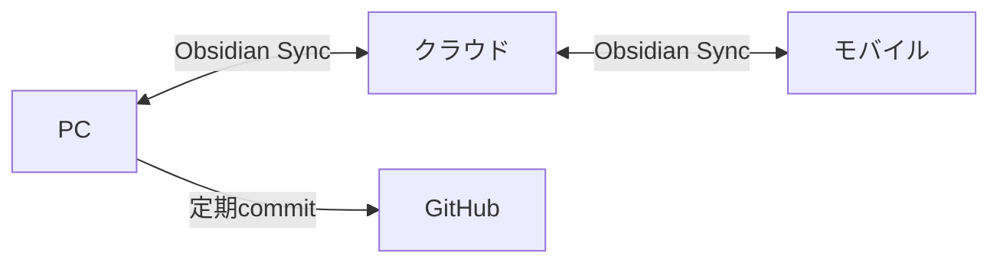

# Obsidian Sync

## チーム共有をさらに強化する

---

## Obsidian Sync とは？

Obsidian公式のクラウド同期サービス

- **エンドツーエンド暗号化**で安全
- **リアルタイム同期**で複数デバイス対応
- **バージョン履歴**で過去の状態に戻せる

---

## なぜ Obsidian Sync？

| 比較項目 | GitHub | Obsidian Sync |
|----------|--------|---------------|
| 同期速度 | commit/push必要 | **リアルタイム** |
| 競合解決 | 手動マージ | **自動マージ** |
| モバイル | 別アプリ必要 | **公式アプリ対応** |
| 暗号化 | なし | **E2E暗号化** |

---

## GitHub と Obsidian Sync の使い分け

### GitHub
- **公式アーカイブ**として使用
- PRベースのレビューフロー
- CI/CD連携

### Obsidian Sync
- **日常の作業同期**に使用
- リアルタイムコラボレーション
- モバイルからのアクセス

---

## 併用のベストプラクティス

1. 普段は **Obsidian Sync** でリアルタイム同期
2. 区切りのタイミングで **GitHub に commit**
3. レビューが必要なものは **PR** を作成

---

## 料金プラン

| プラン | 価格 | 特徴 |
|--------|------|------|
| Standard | $4/月 | 1GB、1年履歴 |
| Plus | $8/月 | 10GB、無制限履歴 |

※ 年払いで割引あり

---

## セットアップ手順

1. Obsidian の設定 → コアプラグイン → **Sync を有効化**
2. Obsidian アカウントでログイン
3. **リモートVaultを作成**または既存を選択
4. 同期開始！

---

## 関連スライド

- 前へ: [[08_rules|運用ルール]]
- 次へ: [[10_summary|まとめ]]
