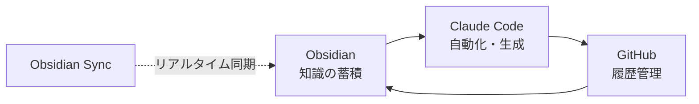

# まとめ

---

## 今日学んだこと

- Obsidianは"ただのメモ"じゃなく**チームの脳**
- Claudeで"コードと仕様の橋渡し"が**自動化**
- GitHubで"生きたドキュメント"が**維持される**
- Obsidian Syncで**リアルタイム共有**も可能

---

## ツールの連携

---

## 今日からできる最初の一歩

> プロジェクト直下に **Obsidian フォルダ置くこと**
>
> これだけで世界変わる。

---

## 具体的なアクション

1. 今のプロジェクトに `docs/` フォルダ作成
2. Obsidian でそのフォルダを Vault として開く
3. 最初の1ページを書いてみる
4. GitHub に commit
5. チーム共有が必要なら Obsidian Sync を検討

---

# ありがとうございました！

質問があればどうぞ

---

## 関連スライド

- 前へ: [[12_obsidian_sync|Obsidian Sync]]
- 最初へ: [[01_title|タイトル]]
- 全体: [[00_presentation|プレゼンテーション全体]]
