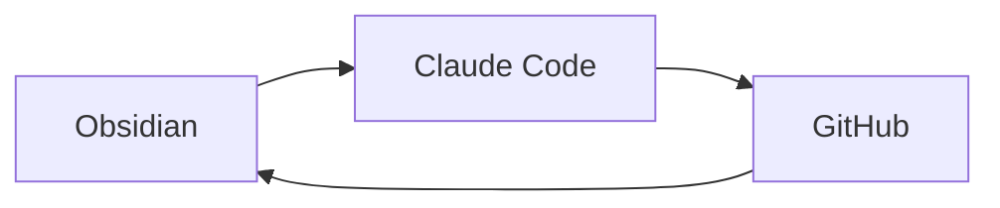

# 3つのツールの役割

---

| ツール | 役割 | 一言 |
|--------|------|------|
| **Obsidian** | 知識管理・仕様書 | チームの"脳みそ" |
| **Claude Code** | コード理解・生成 | チームの家庭教師 |
| **GitHub** | バージョン管理 | 公式アーカイブ |

---

## ポイント

この3つを繋ぐと **爆速でドキュメントが育つ環境** ができる！

---

## 関連スライド

- 前へ: [[02_goal|今日のゴール]]
- 次へ: [[04_practice1|実践① Obsidianをプロジェクトに置く]]
