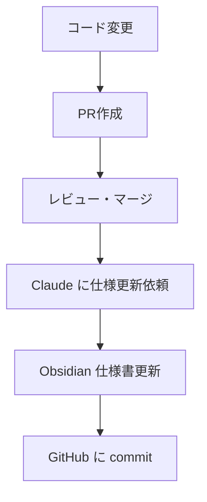

# 実践③ GitHub × Obsidianで"生きてるドキュメント"

---

## 仕様の腐敗を防ぐ

- PR を merge したら「この仕様ページ更新して」とClaudeに依頼
- **差分から仕様反映まで自動**
- ObsidianはローカルだけどGitHubで**履歴管理完璧**

---

## ワークフロー



---

## Claude への指示例

```
このPRの変更内容を元に、
docs/specs/order.md の仕様書を更新してください
```

---

> 仕様の腐敗がなくなる（ガチで激減）

---

## 関連スライド

- 前へ: [[05_practice2|実践② テストコード自動生成]]
- 次へ: [[07_marketing1|マーケター活用例①]]
